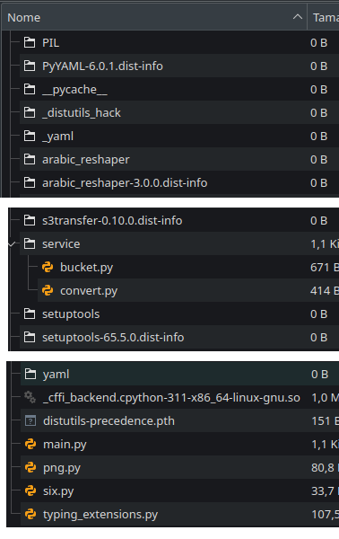

# Conversão automática html para pdf

Aqui criamos um bucket S3 e uma lambda acionada por um trigger do bucket. Toda vez que um arquivo com característica específicas for criado ele acionará uma lambda que realizará a conversão do arquivo html para arquivo pdf. O novo arquivo será colocado no bucket com o prefixo pdf/.

## Montando o ambiente de desenvolvimento

### Pré-requisitos
Para esse projeto vamos precisar:
- docker e docker-compose;
- terraform 1.6+
- python 3.11+
- aws-cli-v2

### 1 - Clone o projeto:
```shell
git clone https://github.com/tadelle/convert_html_to_pdf.git
cd convert_html_to_pdf
```

### 2 - Monte um ambiente virtual:
```shell
cd src
python -m venv venv
```

### 3 - Ative o ambiente virtual (Linux)
```shell
source venv/bin/activate
```

### 4 - Instale a dependências
```shell
pip install -r requirements.txt
```

### 5 - Instale o terraform-local
```shel
pip install terraform-local
```

### 6 - Inicie o container do LocalStack usando docker-compose
```shell
cd ../localstack/
docker compose up -d
```

## Publicando

### 7 - Prepare o pacote da lambda para ser publicado
Devemos compactar todo o conteúdo da pasta site-packages, que contém as bibliotecas usadas pela lambda function.
Procure a pasta site-packages na pasta do seu ambiente virtual.

venv/lib/python3.11/site-packages
ou
venv/Lib/site-packages

Podemos usar qualquer método para produzir o arquivo zip, mas o importante é que o arquivo main.py, assim como a pasta service. As pastas da biblioteca ficam no mesmo nĩvel que o arquivo main. Como mostrado na imagem abaixo.



### 8 - Monte o arquivo .zip a ser usado para publicação da lambda
```shell
cd ../src/venv/lib/python3.11/site-packages
zip lambda.zip *
mv lambda.zip ../../../../
cd ../../../../
zip lambda.zip main.py
zip lambda.zip service/*
mv lambda.zip ../infra/lambda_convert
```

### 9 - Inicie o Terraform
```shell
cd ../infra
tflocal init
```

### 8 - Verifique o planejamento do terraform
```shell
tflocal plan
```

### 9 - Aplique as mudanças
```shell
tflocal apply --auto-approve
```


### 10 - Verifique se o bucket e a lambda foram criados corretamente
```shell
aws s3 ls --endpoint-url=http://localhost:4566
```
Resultado esperado:
```
2024-01-31 21:59:52 my-bucket-test
```

```shell
aws lambda list-functions --endpoint-url=http://localhost:4566
```
Será exibida a lambda e suas propriedades. Para sair pressione q.
```
{
    "Functions": [
        {
            "FunctionName": "lambda_convert",
            "FunctionArn": "arn:aws:lambda:sa-east-1:000000000000:function:lambda_convert",
            "Runtime": "python3.11",

            ...

            "SnapStart": {
                "ApplyOn": "None",
                "OptimizationStatus": "Off"
            }
        }
    ]
}
```

Verifique que até o momento o bucket está vazio
```shell
aws s3 ls my-bucket-test --endpoint-url=http://localhost:4566
```

### 11 - Fazendo upload do arquivo html para o bucket e verificando em seguida
```shell
aws s3 cp exemplo.html s3://my-bucket-test/html --endpoint-url=http://localhost:4566
aws s3 ls my-bucket-test --endpoint-url=http://localhost:4566
```


